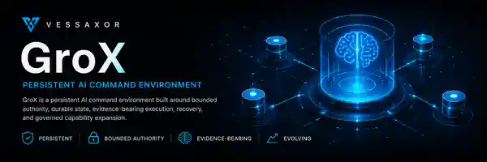

<p align="center">
  
</p>

# GroX

**Latest release:** `v0.7.0`
**Current source package:** `0.7.1`
**Operating standard:** **APEX QUALIFIED**
**Standing Crew:** **82** — 81 specialist-inspired Crew plus 1 native independent verifier
**Canonical release source:** `71ffd60769d81b5b249dac4eca56333ff27e26d0`

GroX is an independent, persistent AI command environment built around a clear chain of command:

**Commander → Pilot GorXu → Divisions → Standing Crew**

The Commander defines intent and retains final authority. Pilot GorXu is the Vessel's second-in-command and sole operational orchestrator. Divisions organize operational areas and Crew. Standing Crew perform bounded work through Mission Orders. Capabilities, tools, schedulers, memory, evaluators, and external systems are resources under this command relationship; they are not command layers.

Mission Control is a GroX-native policy and advisory service used by GorXu for governance, risk analysis, routing support, verification policy, evidence requirements, and operational intelligence. It does not form a second command spine.

## Current qualification state

GroX `v0.7.0` is the first released Apex-qualified baseline.

- **A1 Cognitive Pilot:** SESSION-QUALIFIED with project-hosted GPT-5.6 Sol cognition and deterministic safe fallback.
- **A2 Mission Graph Orchestration:** QUALIFIED.
- **A3 Living Company Intelligence:** QUALIFIED.
- **A4 Executive Exception Loop and Durable Operations:** QUALIFIED.
- **A5 Governed Capability Expansion:** QUALIFIED.
- **A6 Orchestration Intelligence and Self-Improvement:** QUALIFIED.
- **A7 Apex Qualification Gauntlet:** QUALIFIED.
- **GorXu operating standard:** **APEX QUALIFIED**.

Apex is an evidence-backed operating standard, not additional authority. Future changes do not inherit Apex automatically; consequential changes must preserve Commander sovereignty, bounded authority, verifier independence, evidence integrity, recovery, and the qualified execution path through appropriate regression evidence.

## Core operating model

- The Commander sets intent and retains ultimate authority.
- GorXu interprets intent, constructs and adapts Missions, consults relevant services and Crew, issues bounded Mission Orders, resolves ordinary reversible exceptions, and synthesizes outcomes.
- Crew operate only within the authority granted for their current Mission Order.
- Competence does not imply permission.
- Inspection and mutation authority are structurally separate.
- Crew may challenge assumptions, surface blockers, or recommend safer or better paths, but cannot widen their own scope.
- Critical, irreversible, authority-divergent, or material intent-changing decisions return to the Commander.
- Independent verification and attributable evidence are mandatory where policy requires them.

## Live Vessel

The released Vessel includes:

- Commander Seat CLI and interactive bridge;
- persistent least-privilege GitHub Actions CI on pull requests and `main`, including Python 3.11/3.12 regressions and wheel-bootstrap portability checks;
- Pilot GorXu orchestration with provider-neutral cognition and deterministic safe fallback;
- native Mission Control;
- **82 Standing Crew** across nine Divisions;
- durable Mission, Order, Evidence, Crew, memory, performance, graph, evaluation, exception, and recovery state;
- Living Company Intelligence with attributable semantic, procedural, episodic, and Vessel memory plus bounded selective retrieval;
- experienced eligible-Crew routing informed by evidence, reliability, load, cost, latency, and risk;
- durable dependency-aware Mission Graph execution with parallel-ready scheduling and bounded replanning;
- crash-safe same-Mission resume, checkpointing, cancellation, and journaled text-Repair compensation;
- hard Mission cost ceilings with persisted cost commitments so restart cannot reset consumed budget;
- independently verified contradiction synthesis that rejects forged verifier evidence, normalizes duplicate source contribution, and leaves unresolved ties unresolved;
- Tool Gateway v2 with deny-wins action authorization;
- governed isolated workspace execution with namespace-first and digest-pinned commissioned Docker fallback isolation;
- memory-only secret aliases with explicit grants and output redaction;
- exact-origin bounded HTTP(S) fetch plus offline Chromium screenshot/hash evidence capture;
- pre-registered stdio MCP adapters with separately gated mutation authority;
- replayable privacy-minimized orchestration evaluation with evidence-backed improvement proposals that cannot self-activate;
- private integrity-checked `.groxstate` snapshot/restore with source-state compatibility enforcement.

## Qualified limits

The Apex baseline does not claim unrestricted power. Current deliberate limits include:

- cognition remains project/session-hosted with deterministic fallback;
- unrestricted interactive desktop actuation is outside the qualified boundary;
- arbitrary/networked third-party MCP processes are outside the qualified boundary;
- runtime image pulls/builds are not implicit Crew authority;
- generic compensation for arbitrary external systems is not claimed;
- external-agent interoperability remains optional and grants no inherited GroX authority;
- autonomous memory consolidation remains future evolution.

## Quick start

```bash
python -m pip install -e .
grox status
grox roster
grox mission "Inspect the Vessel and report readiness" --mode inspect
grox bridge
```

Vessel-root binding is explicit and fail-closed. GroX resolves `GROX_VESSEL_ROOT` first, then the current checkout ancestry, then the source-module ancestry used by an editable checkout. A non-editable installed CLI may operate from a valid GroX checkout or with `GROX_VESSEL_ROOT` set; outside a bound Vessel it refuses to start rather than constructing an empty company.

## Persistence model

GroX separates continuity into three planes:

1. **Cognitive continuity:** the Space Exploration project reconstitutes GorXu and project context.
2. **Vessel source:** this GitHub repository is the durable source body.
3. **Operational state:** private runtime state travels through verified `.groxstate` snapshots and is never committed publicly.

A sandbox or host is replaceable compute, not the permanent Vessel.

## Documentation map

### Authority and architecture

- `AI_INSTRUCTIONS.md` — repository authority and builder constraints.
- `docs/architecture/ARCHITECTURE.md` — command, runtime, Crew, memory, tool, and recovery architecture.
- `docs/architecture/PERSISTENCE_ARCHITECTURE.md` — three-plane persistence and reconstitution protocol.
- `docs/specification/PRINCIPLES.md` — durable GroX operating principles.
- `docs/specification/MISSION_ORDER.md` — bounded Crew authority contract.
- `docs/specification/MISSION_GRAPH.md` — durable multi-Crew orchestration contract.

### Qualified capability specifications

- `docs/specification/COGNITIVE_PILOT.md` — A1 cognition boundary.
- `docs/specification/LIVING_COMPANY_INTELLIGENCE.md` — A3 memory, performance, and routing intelligence.
- `docs/specification/DURABLE_OPERATIONS.md` — A4 recovery and executive exception loop.
- `docs/specification/GOVERNED_CAPABILITIES.md` — A5 Tool Gateway and governed capability expansion.
- `docs/specification/ORCHESTRATION_EVALUATION.md` — A6 evaluation and non-self-activating improvement proposals.

### Stewardship and history

- `docs/stewardship/APEX_ORCHESTRATOR_PLAN.md` — A1–A7 qualification contract and regression boundary.
- `docs/stewardship/ROADMAP.md` — current post-Apex operating posture and future-evolution rules.
- `docs/stewardship/progress-tracker.md` — canonical project-state tracker and qualification evidence.
- `docs/stewardship/CREW_ROSTER.md` — current 82-Crew company state.
- `docs/stewardship/SANDBOX_COMMISSIONING.md` — historical first-Vessel commissioning record.
- `docs/history/ships-log/` — append-only milestone history; prior entries retain the state that was true when recorded.

## Repository authority

When repository documents conflict, follow the hierarchy in `AI_INSTRUCTIONS.md`. Current evidence and implementation truth override stale descriptive text, while historical records remain historical rather than being rewritten to look current.
