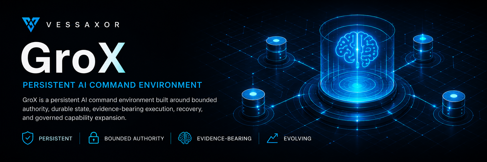

<a id="readme-top"></a>

<p align="center">
  
</p>

<div align="center">

# GroX

### Persistent AI command environment

A persistent AI Vessel for translating **Commander intent into bounded Missions, durable execution, attributable evidence, independent verification, and recoverable continuity**.

[](https://github.com/vessaxor-spec/GroX/actions/workflows/ci.yml)
[](https://github.com/vessaxor-spec/GroX/releases/tag/v0.7.1)

[**Explore the architecture**](docs/architecture/ARCHITECTURE.md) ·
[**See current progress**](docs/stewardship/progress-tracker.md) ·
[**View the roadmap**](docs/stewardship/ROADMAP.md) ·
[**Meet the Crew**](docs/stewardship/CREW_ROSTER.md)

**Release:** `v0.7.1` · **Package:** `0.7.1` · **Operating standard:** `APEX QUALIFIED` · **Standing Crew:** `82`

</div>

---

<details>
<summary><strong>Table of contents</strong></summary>

- [About GroX](#about-grox)
- [How GroX works](#how-grox-works)
- [What GroX owns](#what-grox-owns)
- [Current state](#current-state)
- [Qualified limits](#qualified-limits)
- [Quick start](#quick-start)
- [Persistence and recovery](#persistence-and-recovery)
- [Repository map](#repository-map)
- [Governance and evidence](#governance-and-evidence)
- [Roadmap](#roadmap)

</details>

## About GroX

GroX is an independent, persistent AI command environment built around one canonical command spine:

> **Commander → Pilot GorXu → Divisions → Standing Crew**

The Commander defines intent and retains final authority. Pilot GorXu is the Vessel's second-in-command and sole operational orchestrator. Divisions organize operational areas. Standing Crew perform bounded work through Mission Orders.

Mission Control is a **GroX-native policy and advisory service** used by GorXu for governance, risk analysis, routing support, verification policy, evidence requirements, and operational intelligence. It is not a command layer and cannot become a parallel orchestrator.

### Why this exists

GroX is designed to make capable AI execution durable without making authority ambiguous. It is built to prevent several common failures in autonomous systems:

- treating a model session as the whole system;
- confusing competence with permission;
- allowing Crew, tools, evaluators, or schedulers to become parallel orchestrators;
- losing Mission state, evidence, or recovery context when a process or host disappears;
- letting retries, replanning, or fallback silently widen authority;
- allowing an executor to satisfy an independence requirement by verifying itself;
- representing experiments, simulations, or staged behavior as stronger operational proof than the evidence supports;
- allowing improvement proposals to self-activate without governed approval.

## How GroX works

GroX keeps command authority separate from the services and capabilities used to execute work:

```text
Commander intent
  -> Pilot GorXu
     -> consults Mission Control when required
     -> constructs a Mission or Mission Graph
     -> selects eligible Standing Crew
     -> issues bounded Mission Orders
        -> governed capabilities and tools
        -> attributable evidence
     -> independent verification when required
     -> Pilot synthesis
     -> Commander escalation for critical, irreversible,
        authority-divergent, or material intent-changing decisions
```

Capabilities, tools, schedulers, memory, evaluators, and external systems are resources under this relationship. They are not command layers.

### Core operating principles

1. **Commander sovereignty.** The Commander sets intent and retains ultimate authority.
2. **One operational orchestrator.** GorXu is the sole operational orchestrator; no Crew member or subsystem may become a rival command spine.
3. **Competence is not permission.** Crew may act only within the authority granted by the current Mission Order.
4. **Inspection is not mutation.** Inspect and Repair authority remain structurally separate.
5. **Deny wins.** Tool access is capability-gated and constrained by Mission Order, Crew capability, and host policy.
6. **Verification remains independent.** Where policy requires independence, the verifier must differ from the executor and evidence must be attributable.
7. **Failure narrows authority.** Recovery, fallback, and replanning may restore reversible execution but may not widen scope or change Commander intent.
8. **Continuity requires evidence.** Persistence, recovery, and reconstitution are operational infrastructure, not assumptions about a surviving process.

Canonical builder constraints are defined in [`AI_INSTRUCTIONS.md`](AI_INSTRUCTIONS.md). Detailed command and runtime architecture is defined in [`docs/architecture/ARCHITECTURE.md`](docs/architecture/ARCHITECTURE.md).

## What GroX owns

| GroX owns | GroX deliberately does not own |
|---|---|
| interpretation and execution of Commander intent | authority to replace or silently rewrite Commander intent |
| Mission and Mission Graph orchestration | self-authorizing goals or a second command spine |
| Standing Crew selection and bounded Mission Orders | Crew self-promotion, self-authorization, or scope widening |
| native Mission Control policy and advisory support | a parallel Mission Control command hierarchy |
| capability and Tool Gateway authorization | permission to exceed host policy or Mission authority |
| evidence capture and verifier assignment | executor self-verification where independence is required |
| durable operational state, snapshots, and reconstitution | public storage of private runtime state or secrets |
| evidence-backed evaluation and improvement proposals | automatic self-activation of proposed changes |

## Current state

GroX has completed the A1-A7 Apex qualification path and is operating in protected post-Apex evolution.

| Surface | Current state |
|---|---|
| Current released baseline | [`v0.7.1`](https://github.com/vessaxor-spec/GroX/releases/tag/v0.7.1), post-Apex operational hardening |
| First Apex-qualified release | `v0.7.0` |
| Operating standard | **APEX QUALIFIED** |
| Command spine | Commander → Pilot GorXu → Divisions → Standing Crew |
| Standing company | **82 Crew** across nine Divisions |
| Canonical source | protected `main`; source may advance beyond the release through the governed PR/CI path |
| CI boundary | Python 3.11-3.14 regressions plus wheel-bootstrap portability; five required gates |
| Current evolution program | [`Post-Apex Operational Evolution Program 001`](docs/stewardship/POST_APEX_EVOLUTION_PROGRAM_001.md) |
| Completed program work | capability intake, critical mutation proving, Vessel health, tiered reconstitution, controlled context heat/compression experiment |
| Next program stage | **#28 A6 longitudinal operational drift analysis** |
| Canonical current status | [`docs/stewardship/progress-tracker.md`](docs/stewardship/progress-tracker.md) |

The live Vessel includes Commander Seat interfaces, durable Missions and Mission Graphs, 82 Standing Crew, attributable organizational memory, capability-gated execution, independent verification, crash-safe same-Mission recovery, bounded replanning, Tool Gateway v2, isolated workspace execution, exact-origin network access, offline browser evidence capture, pre-registered stdio MCP adapters, evaluation that cannot self-activate, read-only Vessel health, tiered reconstitution planning, and integrity-checked private state snapshots.

<details>
<summary><strong>Current qualification and evidence snapshot</strong></summary>

### Apex qualification

| Stage | Status |
|---|---|
| A1 Cognitive Pilot | SESSION-QUALIFIED |
| A2 Mission Graph Orchestration | QUALIFIED |
| A3 Living Company Intelligence | QUALIFIED |
| A4 Executive Exception Loop and Durable Operations | QUALIFIED |
| A5 Governed Capability Expansion | QUALIFIED |
| A6 Orchestration Intelligence and Self-Improvement | QUALIFIED |
| A7 Apex Qualification Gauntlet | QUALIFIED |
| GorXu operating standard | **APEX QUALIFIED** |

Apex is an evidence-backed regression boundary, not additional authority and not inherited permission for future changes.

### Post-Apex control evidence

Current protected evolution has added continuous proof around high-consequence controls:

- **12/12** Stage 1 critical-detector mutations killed;
- **7/7** Stage 2 Vessel-health mutations killed;
- **9/9** Stage 3 reconstitution mutations killed;
- native `grox health` remains read-only and isolated from Repair authority;
- `grox reconstitution-plan` selects FAST, TARGETED, or FULL recovery scope without duplicating health truth or widening authority;
- the controlled Stage 4 HOT/WARM/COLD experiment retained **100% of declared critical facts and retained provenance** while reducing the bounded corpus from 20,464 to 1,336 characters, a **93.47% controlled character reduction**;
- that Stage 4 result is an experimental character-count result, not a production token, latency, or runtime-activation claim;
- automatic Pilot context compression remains deferred until integrated operational evidence supports activation.

Historical red runs remain evidence rather than being erased to create a clean narrative. Exact current milestones, run IDs, and qualification evidence are maintained in the [`Progress Tracker`](docs/stewardship/progress-tracker.md), [`Roadmap`](docs/stewardship/ROADMAP.md), and Ship's Log.

</details>

## Qualified limits

The Apex baseline does not claim unrestricted power. Current deliberate limits include:

- cognition remains project/session-hosted with deterministic safe fallback;
- unrestricted interactive desktop actuation is outside the qualified boundary;
- arbitrary or networked third-party MCP processes are outside the qualified boundary;
- runtime image pulls or builds are not implicit Crew authority;
- generic compensation for arbitrary external systems is not claimed;
- external-agent interoperability remains optional and grants no inherited GroX authority;
- autonomous memory consolidation remains future evolution;
- controlled context compression is not automatically active in Pilot runtime.

A missing provider, unavailable isolation backend, stale evidence, or ambiguous recovery condition causes safe degradation or broader recovery requirements, never authority expansion.

## Quick start

### Prerequisites

- Python **3.11+**
- Git

### Install the Vessel

```bash
git clone https://github.com/vessaxor-spec/GroX.git
cd GroX
python -m pip install -e .
```

For local testing:

```bash
python -m pip install -e '.[test]'
pytest
```

### Inspect the Vessel

```bash
grox status
grox roster
grox health
grox reconstitution-plan
```

### Run a bounded Mission

```bash
grox mission "Inspect the Vessel and report readiness" --mode inspect
```

### Enter the Commander bridge

```bash
grox bridge
```

Vessel-root binding is explicit and fail-closed. GroX resolves `GROX_VESSEL_ROOT` first, then current-checkout ancestry, then editable-source ancestry. A non-editable installed CLI may operate from a valid GroX checkout or with `GROX_VESSEL_ROOT` set; outside a bound Vessel it refuses to construct an empty company.

## Persistence and recovery

GroX separates continuity into three planes:

1. **Cognitive continuity:** the current project/session layer reconstitutes GorXu and active cognitive context.
2. **Vessel source:** this repository is the durable source body.
3. **Operational state:** private SQLite state and `.groxstate` archives preserve Missions, Orders, Evidence, Crew state, memory, performance, graphs, evaluation, exceptions, and recovery state outside public Git.

A sandbox, runner, or host is replaceable compute, not the permanent Vessel.

### Reconstitution rule

A fresh or uncertain host may resume GroX only after source materialization, private-state verification or restoration when needed, integrity gates, and GorXu reconstitution. Recovery scope increases when evidence is missing or unsafe:

- **FAST** requires positive mandatory health evidence and clean source state.
- **TARGETED** is limited to bounded noncritical WARN/UNKNOWN conditions after all FULL triggers are excluded.
- **FULL** is required for fresh hosts, source changes, critical failures, non-PASS recovery readiness, unsafe in-flight state, dirty source, persistence warnings/failures, or missing/non-PASS mandatory evidence.

Failure or ambiguity never grants additional authority.

See [`docs/architecture/PERSISTENCE_ARCHITECTURE.md`](docs/architecture/PERSISTENCE_ARCHITECTURE.md) and the current [`Roadmap`](docs/stewardship/ROADMAP.md).

## Repository map

```text
.
├── README.md                     # public entry point
├── AI_INSTRUCTIONS.md            # repository authority and builder constraints
├── .github/workflows/ci.yml      # protected five-gate CI
├── assets/                       # public visual assets
├── configs/                      # Vessel configuration and persistence bindings
├── docker/                       # governed container support
├── docs/                         # architecture, specification, stewardship, history
├── policy/                       # GroX-native policy and authority controls
├── scripts/                      # validation, experiments, mutation and maintenance tools
├── src/                          # GroX runtime implementation
├── tests/                        # unit, integration, contract, experiment and mutation evidence
└── pyproject.toml                # package and CLI definition
```

### Documentation map

| If you want to understand... | Start here |
|---|---|
| repository authority and builder constraints | [`AI_INSTRUCTIONS.md`](AI_INSTRUCTIONS.md) |
| command and runtime architecture | [`docs/architecture/ARCHITECTURE.md`](docs/architecture/ARCHITECTURE.md) |
| persistence and reconstitution | [`docs/architecture/PERSISTENCE_ARCHITECTURE.md`](docs/architecture/PERSISTENCE_ARCHITECTURE.md) |
| durable operating principles | [`docs/specification/PRINCIPLES.md`](docs/specification/PRINCIPLES.md) |
| bounded Crew authority | [`docs/specification/MISSION_ORDER.md`](docs/specification/MISSION_ORDER.md) |
| Mission Graph execution | [`docs/specification/MISSION_GRAPH.md`](docs/specification/MISSION_GRAPH.md) |
| current Vessel status | [`docs/stewardship/progress-tracker.md`](docs/stewardship/progress-tracker.md) |
| current strategic direction | [`docs/stewardship/ROADMAP.md`](docs/stewardship/ROADMAP.md) |
| Apex regression boundary | [`docs/stewardship/APEX_ORCHESTRATOR_PLAN.md`](docs/stewardship/APEX_ORCHESTRATOR_PLAN.md) |
| post-Apex evolution program | [`docs/stewardship/POST_APEX_EVOLUTION_PROGRAM_001.md`](docs/stewardship/POST_APEX_EVOLUTION_PROGRAM_001.md) |
| current Standing Crew | [`docs/stewardship/CREW_ROSTER.md`](docs/stewardship/CREW_ROSTER.md) |
| historical milestones | [`docs/history/ships-log/`](docs/history/ships-log/) |

## Governance and evidence

GroX distinguishes authority, implementation, evidence, verification, recovery, and release decisions rather than treating code existence as proof of operational qualification.

### Authority hierarchy

When repository sources disagree, use the hierarchy defined in [`AI_INSTRUCTIONS.md`](AI_INSTRUCTIONS.md):

1. Commander directives;
2. `AI_INSTRUCTIONS.md`;
3. canonical architecture and specification documents;
4. stewardship documents;
5. current code and tests;
6. builder judgment.

Higher authority wins when instructions conflict. Historical records remain historical rather than being rewritten to appear current.

### Evidence discipline

- implementation is not qualification;
- a green CI run proves the checks it actually executed, not a broader claim;
- controlled experiments remain distinct from integrated operational evidence;
- red evidence is preserved when it reveals a real weakness or ambiguity;
- consequential changes must preserve Commander sovereignty, GorXu's sole-orchestrator role, bounded Mission Orders, verifier independence, evidence integrity, recovery, and source/state compatibility;
- private SQLite state, `.groxstate` archives, and secrets remain outside public Git by design.

The README is an entry point. It does not outrank current repository authority, implementation evidence, the Progress Tracker, or the Roadmap.

## Roadmap

The Apex critical path is complete. GroX is now evolving through **Post-Apex Operational Evolution Program 001** without introducing a predeclared A8.

Completed program stages include:

- external capability intake convention;
- continuous critical-detector mutation proving;
- native read-only Vessel health;
- tiered FAST/TARGETED/FULL reconstitution planning;
- controlled HOT/WARM/COLD context policy experiment.

The next approved stage is **#28 A6 longitudinal operational drift analysis**, followed by mission-to-source provenance research and integrated operational qualification of the changed surfaces. Completion of an individual stage does not imply a version bump, release tag, new Apex stage, or authority expansion.

The Commander retains the release decision.

See the canonical [`Roadmap`](docs/stewardship/ROADMAP.md) for current sequencing and evidence boundaries.

---

<div align="center">

**Persistent continuity. Bounded authority. Evidence-bearing execution.**

[Back to top](#readme-top)

</div>
